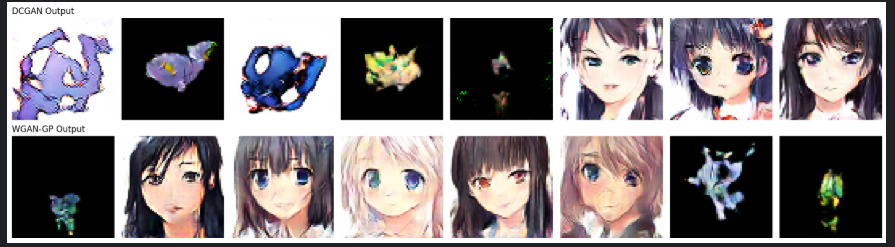

# Anime-Pokemon-GAN-Studio

A dual-model GAN generation project and demo app built around custom checkpoints trained on an Anime + Pokemon dataset.

This repository contains:
- A Streamlit application for image generation and model comparison.
- Trained GAN checkpoints (`.pt`) for DCGAN and WGAN-GP generators.
- The original training notebook (`.ipynb`).

## Project Overview

This project focuses on generative modeling for stylized 64x64 RGB outputs using two architectures:

- **DCGAN**
  - Designed to generate both anime-style faces and pokemon-like sprite outputs.
  - Useful for mixed-style sampling and creative variety.

- **WGAN-GP**
  - Trained for more stable and higher-quality anime face generation.
  - Uses Wasserstein objective with gradient penalty for improved training behavior.

Both models generate from a latent vector of size `100` and output normalized RGB images (`3 x 64 x 64`).

## Demo Preview



## Repository Structure

- `app.py`
  - Streamlit UI for loading checkpoints and running inference.
  - Supports single-model generation and side-by-side comparison.
  - Includes seed control, image count control, timing, and downloads.

- `genpokimon.ipynb`
  - Training and experimentation notebook.

- `dcgan_epoch_35.pt`
  - Trained DCGAN generator checkpoint.

- `wgangp_epoch_60.pt`
  - Trained WGAN-GP generator checkpoint.

- `comparison.png`
  - Visual sample used in this README.

## Features

- Model selection: **DCGAN** or **WGAN-GP**
- Side-by-side comparison mode
- Adjustable generation count (`1-64`)
- Seed-based reproducibility
- Runtime generation timing
- PNG and ZIP download support for generated outputs
- CPU-compatible inference with `torch.no_grad()`

## Technical Details

- Image size: `64x64`
- Channels: `3 (RGB)`
- Latent dimension (`z`): `100`
- Output normalization for display: from `[-1, 1]` to `[0, 1]`

Generator stack pattern:
- `ConvTranspose2d`: `z -> 512 -> 256 -> 128 -> 64 -> 3`
- `BatchNorm2d` after intermediate transposed-convolution layers
- `ReLU` activations
- `Tanh` output activation

## Setup

### 1) Clone

```bash
git clone https://github.com/muneeb-codehub/Anime-Pokemon-GAN-Studio.git
cd Anime-Pokemon-GAN-Studio
```

### 2) Install dependencies

```bash
pip install streamlit torch torchvision pillow numpy
```

### 3) Run app

```bash
python -m streamlit run app.py --server.headless true --server.port 8501
```

Then open:
- `http://localhost:8501`

## Notes

- Checkpoints are loaded from the repository root directory.
- If running on CPU-only machines, inference still works (slower than CUDA).
- Use the same seed to reproduce the same generated outputs.

## License

This project is shared for educational and portfolio purposes.
